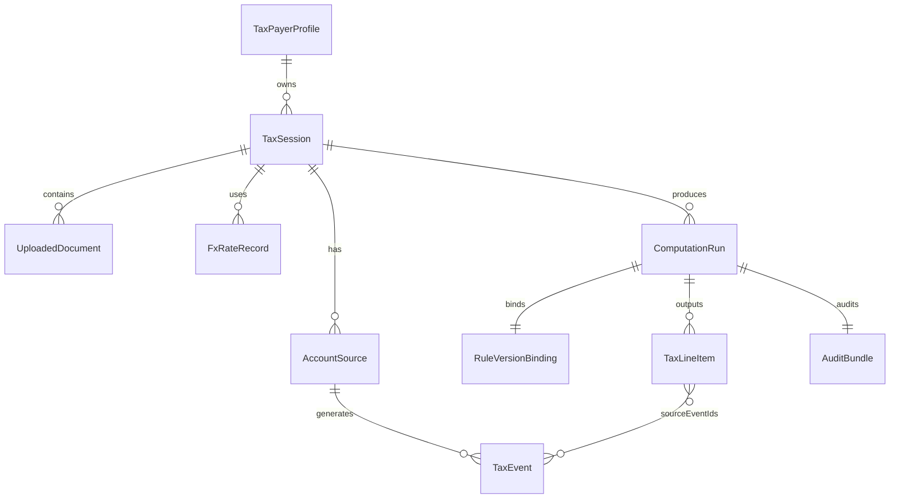

# Tax Canonical Data Model v1

> **状态**：Frozen Schema v1.0.0  
> **修订日期**：2026-06-04  
> **机器可读**：[../schemas/](../schemas/)

---

## 1. 设计原则

1. **双币种记账**：每笔金额保留 `amountOriginal` + `currency` + `amountCny` + `fxRateUsed`。
2. **事件溯源**：所有聚合结果必须携带 `sourceEventIds[]`。
3. **规则快照绑定**：每次计算写入 `ruleSnapshotId`，保证可复现。
4. **PII 隔离**：`TaxPayerProfile` 与 `AccountSource` 分表；日志仅存哈希与脱敏 ID。

---

## 2. 实体关系



---

## 3. 核心实体

### 3.1 TaxPayerProfile

| 字段 | 类型 | 必填 | 说明 |
|------|------|------|------|
| `profileId` | UUID | Y | 内部 ID |
| `userId` | string | Y | 平台用户 ID |
| `residentStatus` | enum | Y | `cn_tax_resident`, `non_resident`, `uncertain` |
| `taxResidencyCountry` | ISO3166 | Y | 默认 `CN` |
| `idDocumentHash` | string | N | 证件号 SHA-256，不落明文 |
| `declaredAt` | datetime | Y | 用户确认时间 |

### 3.2 TaxSession

| 字段 | 类型 | 必填 | 说明 |
|------|------|------|------|
| `sessionId` | UUID | Y | 对话会话 |
| `taxYear` | integer | Y | 如 2024 |
| `fxPolicy` | enum | Y | 见 §5 |
| `filingScope` | enum | Y | `foreign_only`, `includes_domestic` |
| `status` | enum | Y | `draft`, `parsed`, `computed`, `archived` |

### 3.3 AccountSource

| 字段 | 类型 | 必填 | 说明 |
|------|------|------|------|
| `accountId` | UUID | Y | |
| `brokerTemplateId` | string | Y | 如 `broker_ibkr_v1` |
| `brokerName` | string | Y | |
| `country` | ISO3166 | Y | 账户开立国，通常 `US` |
| `accountCurrency` | ISO4217 | Y | 通常 `USD` |
| `accountNumberMasked` | string | N | 仅后四位 |

### 3.4 TaxEvent（原子事件）

| 字段 | 类型 | 必填 | 说明 |
|------|------|------|------|
| `eventId` | UUID | Y | |
| `accountId` | UUID | Y | |
| `eventType` | enum | Y | `DIVIDEND`, `CAPITAL_GAIN`, `INTEREST`, `WITHHOLDING_TAX`, `FEE`, `OTHER` |
| `tradeDate` | date | Y | |
| `settleDate` | date | N | |
| `symbol` | string | N | 如 `AAPL` |
| `quantity` | decimal | N | |
| `grossAmount` | Money | Y | 税前总额（原币） |
| `withholdingTax` | Money | N | 预扣税（正数表示已扣） |
| `fee` | Money | N | |
| `netAmount` | Money | N | |
| `description` | string | N | 原始描述 |
| `sourceRowRef` | string | Y | `fileId:sheet:row` |
| `parseConfidence` | float | Y | 0–1 |
| `classificationStatus` | enum | Y | `confirmed`, `inferred`, `ambiguous` |

**Money 结构**：

```json
{
  "amount": "123.45",
  "currency": "USD"
}
```

### 3.5 FxRateRecord

| 字段 | 类型 | 必填 | 说明 |
|------|------|------|------|
| `fxId` | UUID | Y | |
| `rateDate` | date | Y | |
| `fromCurrency` | ISO4217 | Y | |
| `toCurrency` | ISO4217 | Y | 固定 `CNY` |
| `rate` | decimal | Y | |
| `source` | enum | Y | `safe_harbor_monthly`, `safe_harbor_yearly`, `user_override`, `pboc_spot` |
| `priority` | int | Y | 冲突时取高优先级 |

### 3.6 RuleVersionBinding

| 字段 | 类型 | 必填 | 说明 |
|------|------|------|------|
| `bindingId` | UUID | Y | |
| `rulePackId` | string | Y | 如 `cn_resident_us_equity` |
| `ruleSnapshotId` | string | Y | 如 `cn_resident_us_equity@2026.06.01` |
| `effectiveFrom` | date | Y | |
| `effectiveTo` | date | N | |
| `checksum` | string | Y | 规则包 SHA-256 |

### 3.7 ComputationRun

| 字段 | 类型 | 必填 | 说明 |
|------|------|------|------|
| `runId` | UUID | Y | |
| `sessionId` | UUID | Y | |
| `ruleSnapshotId` | string | Y | |
| `requestedAt` | datetime | Y | |
| `completedAt` | datetime | N | |
| `status` | enum | Y | `success`, `partial`, `failed` |
| `riskLevel` | enum | Y | `low`, `medium`, `high` |
| `confidenceScore` | float | Y | 0–1 |

### 3.8 TaxLineItem（计算输出行）

| 字段 | 类型 | 必填 | 说明 |
|------|------|------|------|
| `lineId` | UUID | Y | |
| `runId` | UUID | Y | |
| `taxCategory` | string | Y | 如 `cn_dividend_20` |
| `taxableIncomeCny` | decimal | Y | |
| `taxRate` | decimal | Y | |
| `taxDueCny` | decimal | Y | |
| `foreignTaxPaidCny` | decimal | N | |
| `creditAllowedCny` | decimal | N | |
| `netTaxDueCny` | decimal | Y | |
| `sourceEventIds` | UUID[] | Y | |
| `formulaSteps` | FormulaStep[] | Y | |

**FormulaStep**：

```json
{
  "stepIndex": 1,
  "label": "convert_to_cny",
  "expression": "grossAmount * fxRate",
  "inputs": { "grossAmount": 100, "fxRate": 7.12 },
  "output": 712.0
}
```

### 3.9 AuditBundle（审计包）

| 字段 | 类型 | 必填 | 说明 |
|------|------|------|------|
| `auditId` | UUID | Y | |
| `runId` | UUID | Y | |
| `inputFileHashes` | string[] | Y | SHA-256 |
| `ruleSnapshotId` | string | Y | |
| `parameterSnapshot` | object | Y | 完整计算参数 JSON |
| `resultHash` | string | Y | 输出行集合哈希 |
| `disclaimerVersion` | string | Y | |
| `createdAt` | datetime | Y | |

---

## 4. 枚举定义

### 4.1 eventType → taxCategory 默认映射（v1）

| eventType | taxCategory | 备注 |
|-----------|-------------|------|
| `DIVIDEND` | `cn_interest_dividend` | 利息、股息、红利所得 |
| `CAPITAL_GAIN` | `cn_property_transfer` | 财产转让所得 |
| `INTEREST` | `cn_interest` | 利息所得 |
| `WITHHOLDING_TAX` | `foreign_tax_paid` | 抵免输入，非应税收入 |
| `FEE` | `cost_adjustment` | 减少资本利得计税基础 |

### 4.2 fxPolicy

| 值 | 说明 |
|----|------|
| `cn_annual_filing` | **默认（合规）** 正常年度汇算：全事件统一按 `filingDate` **上一月末** PBOC 中间价；见 [cn-fx-filing-rules-v1.md](cn-fx-filing-rules-v1.md) |
| `cn_supplemental` | **合规** 以前年度补缴：全事件统一按 `(filingDate.year - 1)-12` 月末中间价 |
| `safe_harbor_monthly` | 辅助核对：按交易发生日当月中间价（逐笔） |
| `safe_harbor_yearly` | 辅助核对：按纳税年度平均汇率 |
| `user_override` | 用户上传汇率表 |

`filingDate`（`YYYY-MM-DD`）：`cn_annual_filing` / `cn_supplemental` 必填或走默认（正常汇算默认 `{taxYear+1}-04-01`；补缴默认当天）。

---

## 5. 数据质量报告（DataQualityReport）

解析完成后随 `datasetId` 返回：

```json
{
  "datasetId": "uuid",
  "totalRows": 1200,
  "parsedEvents": 1180,
  "errors": [
    { "row": "file1:Trades:45", "code": "MISSING_AMOUNT", "message": "Amount empty" }
  ],
  "warnings": [
    { "code": "AMBIGUOUS_EVENT_TYPE", "count": 3 }
  ],
  "coverage": {
    "dividend": 0.98,
    "capital_gain": 0.95,
    "withholding": 0.90
  }
}
```

---

## 6. API 载荷示例

### POST /tax/upload 响应

```json
{
  "datasetId": "d-uuid",
  "sessionId": "s-uuid",
  "dataQuality": { "...": "..." },
  "eventCount": 1180,
  "accounts": ["acc-uuid-1"]
}
```

### POST /tax/compute 请求

```json
{
  "datasetId": "d-uuid",
  "sessionId": "s-uuid",
  "taxYear": 2024,
  "ruleSnapshotId": "latest_stable",
  "userIntent": "estimate_cn_tax_on_us_equity",
  "overrides": { "fxPolicy": "safe_harbor_monthly" }
}
```

---

## 7. 版本与兼容

- Schema 版本：`canonical.v1.0.0`
- 破坏性变更升 `v2`，旧数据只读归档
- JSON Schema 文件：`schemas/tax_*.schema.json`

---

## 8. 变更记录

| 版本 | 日期 | 说明 |
|------|------|------|
| v1.0.0 | 2026-06-04 | 初始发布 |
