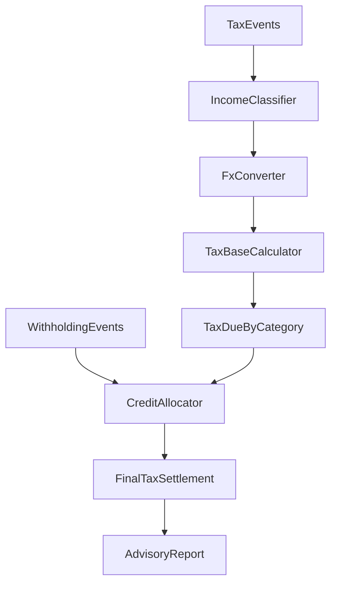

# 中国口径 · 美股收入测算规格 v1

> **状态**：Frozen — v1.0  
> **修订日期**：2026-06-04  
> **规则快照**：`cn_resident_us_equity@2026.06.01`

---

## 1. 计算总览



---

## 2. 前置闸门

| 条件 | 行为 |
|------|------|
| `residentStatus != cn_tax_resident` | 停止；提示非本规则包范围 |
| `residentStatus == uncertain` | 仅输出教育性说明 + 必填清单，**不输出单点 netTaxDue** |
| `dataQuality.coverage.withholding < 0.8` | `riskLevel >= medium`，抵免按区间估算 |
| 存在 `classificationStatus == ambiguous` 且影响金额 > 1000 CNY | `riskLevel = high` |

---

## 3. IncomeClassifier

### 3.1 券商行 → eventType

| 原始关键词（IBKR 示例） | eventType |
|------------------------|-----------|
| `Cash Dividend`, `Payment in Lieu` | `DIVIDEND` |
| `Sell`, `Trades`, `Realized P/L` | `CAPITAL_GAIN` |
| `Credit Interest`, `Interest` | `INTEREST` |
| `Withholding Tax`, `NRA Tax` | `WITHHOLDING_TAX` |
| `Commission`, `Fee` | `FEE` |

### 3.2 eventType → taxCategory

见 [canonical-data-model-v1.md](canonical-data-model-v1.md) §4.1。

### 3.3 资本利得配对（FIFO）

1. 按 `symbol` 分组。
2. 买入事件建立 lot 队列（`quantity`, `costPerShare`, `fees`）。
3. 卖出事件按 FIFO 消耗 lot，计算：

```text
realizedGainUsd = proceeds - costBasis          # 单笔 disposal 损益（USD）
grossProceedsUsd = proceeds + sellFee           # 申报「总收入」
reasonableFeeUsd = sellFee                      # 申报「合理费用」
annualNetUsd = Σ grossProceeds - Σ costBasis - Σ reasonableFee
```

4. 若卖出数量超过持仓 → `classificationStatus = ambiguous`，`riskLevel >= medium`。

5. **SSOT**：`TaxEvent.gross_amount = realizedGainUsd`；卖出佣金在申报「合理费用」列扣除一次，禁止在 `gross_amount` 再减。详见 [agent-consensus-v1.md](agent-consensus-v1.md)。

6. `FEE` 事件：优先抵扣同 symbol 下一笔 `CAPITAL_GAIN` 的计税基础（独立 FEE 行场景）。

---

## 4. FxConverter

**默认（合规申报）**：见 [cn-fx-filing-rules-v1.md](cn-fx-filing-rules-v1.md) 与 `fx_policy.yaml`

| `fxPolicy` | 折算规则 |
|------------|----------|
| `cn_annual_filing` | 全事件统一：`filingDate` 上一月末 PBOC 中间价 |
| `cn_supplemental` | 全事件统一：`(filingDate.year - 1)-12-31` 对应月末中间价 |
| `safe_harbor_monthly` | 辅助：按 `tradeDate` 当月中间价（逐笔） |
| `safe_harbor_yearly` | 辅助：按 `taxYear` 年平均 |

须记录 `fxRateUsed`, `fxRateSource`（含规则说明文案）到事件字段。

---

## 5. TaxBaseCalculator

### 5.1 分红（DIVIDEND → cn_interest_dividend）

```text
taxableIncomeCny = Σ grossAmountCny  (eventType=DIVIDEND, 同年 taxYear)
taxDueCny = taxableIncomeCny * 0.20
```

**说明**：美股分红通常已被美国按 30%（或条约税率）预扣；预扣金额来自 `WITHHOLDING_TAX` 或分红行内 `withholdingTax` 字段。

### 5.2 资本利得（CAPITAL_GAIN → cn_property_transfer）

```text
annualNetCny = Σ realizedGainCny          # 同纳税年度全部处置损益合计
taxableIncomeCny = max(0, annualNetCny)   # 同年度盈亏相抵，净亏损按 0
taxDueCny = taxableIncomeCny * 0.20
```

**汇总规则**：境外股票/期权等财产转让，征管实操允许**同一纳税年度内盈亏相抵**（净额申报）；**不得跨年**结转亏损。法律依据与出处见 [cn-overseas-property-transfer-netting-v1.md](cn-overseas-property-transfer-netting-v1.md)。

**辅助对照**：引擎另输出「按次 max(损益,0) 不抵减」金额，仅供审计比对，非默认申报口径。

亏损：`annualNetCny < 0` 时记入 `lossCarryforwardLedger`（v1 仅报告，不自动跨年度结转）。

### 5.3 利息（INTEREST → cn_interest）

同分红，使用 `cn_interest` 税目。

---

## 6. CreditCalculator（境外税额抵免）

### 6.1 境外已纳税额归集

来源：

1. `WITHHOLDING_TAX` 事件（正数 = 已扣）
2. `DIVIDEND` / `INTEREST` 行内 `withholdingTax`

```text
foreignTaxPaidCny_byCategory = 按 taxCategory 分摊已扣税额
```

### 6.2 分项抵免限额（per_item_limit）

对每个 `taxCategory`：

```text
creditAllowedCny = min(foreignTaxPaidCny, taxDueCny)
netTaxDueCny = taxDueCny - creditAllowedCny
```

### 6.3 预扣税无法匹配到税目时

按 `taxDue` 比例分摊（`proportional_by_tax_due`）：

```text
share_i = taxDueCny_i / Σ taxDueCny
allocatedForeignTax_i = foreignTaxPaidCny_total * share_i
```

### 6.4 数值示例

| 项目 | 美元 | 汇率 | 人民币 | 税率 | 应纳税 | 境外已扣(USD) | 已扣(CNY) | 可抵免 | 应补 |
|------|------|------|--------|------|--------|---------------|-----------|--------|------|
| 分红 | 1,000 | 7.10 | 7,100 | 20% | 1,420 | 300 | 2,130 | 1,420 | 0 |
| 资本利得 | 500 | 7.10 | 3,550 | 20% | 710 | 0 | 0 | 0 | 710 |
| **合计** | | | | | **2,130** | | **2,130** | **1,420** | **710** |

---

## 7. FinalTaxSettlement

```text
totalTaxDueCny = Σ taxDueCny_i
totalCreditAllowedCny = Σ creditAllowedCny_i
totalNetTaxDueCny = Σ netTaxDueCny_i
```

**区间模式**（`confidenceScore < 0.85` 或 `riskLevel = medium`）：

```text
netTaxDueRangeCny.low  = totalNetTaxDueCny * 0.95
netTaxDueRangeCny.high = totalNetTaxDueCny * 1.10
```

---

## 8. 申报建议生成（非代填）

### 8.1 材料清单模板

1. 境外所得个人所得税自行纳税申报表（B 表）及附表  
2. 美股券商年度对账单（英文原件 + 自行翻译说明如需要）  
3. 分红明细、交易明细（已由 Agent 解析为 `TaxEvent` 导出 CSV）  
4. 境外已纳税额凭证（1099-DIV / 券商预扣税汇总）  
5. 汇率换算说明（附 `FxRateRecord` 导出）  
6. 计算审计包 `auditBundle.json`

### 8.2 CRS 一致性检查

- 对比用户声明账户数与解析出的 `AccountSource` 数量  
- 若「声明 1 个账户、解析 3 个」→ 风险提示 `CRS_ACCOUNT_MISMATCH`

---

## 9. FormulaSteps 标准序列

每个 `TaxLineItem` 必须包含：

| stepIndex | label | 说明 |
|-----------|-------|------|
| 1 | `aggregate_gross_cny` | 汇总原币并折算 |
| 2 | `apply_tax_rate` | 适用税率 |
| 3 | `compute_tax_due` | 应纳税额 |
| 4 | `allocate_foreign_tax` | 分摊境外已纳税额 |
| 5 | `apply_credit_limit` | 抵免限额 |
| 6 | `net_tax_due` | 应补税额 |

---

## 10. 假设场景对比

用户请求「对比两种汇率口径」时：

- 同一 `datasetId` 发起两次 `ComputationRun`
- `fxPolicy` 分别为 `safe_harbor_monthly` 与 `safe_harbor_yearly`
- 输出并列摘要表，**不合并为单一申报建议**

---

## 11. 与对话 Agent 的衔接

| 用户话术 | 结构化 intent |
|----------|---------------|
| 算一下我要交多少税 | `estimate_cn_tax_on_us_equity` |
| 分红和炒股分开算 | `estimate_cn_tax_on_us_equity` + `groupBy=eventType` |
| 用年度平均汇率 | `overrides.fxPolicy=safe_harbor_yearly` |
| 给我申报清单 | `filing_checklist_only` |

---

## 12. 变更记录

| 版本 | 日期 | 说明 |
|------|------|------|
| v1.0 | 2026-06-04 | 初始测算规格 |
