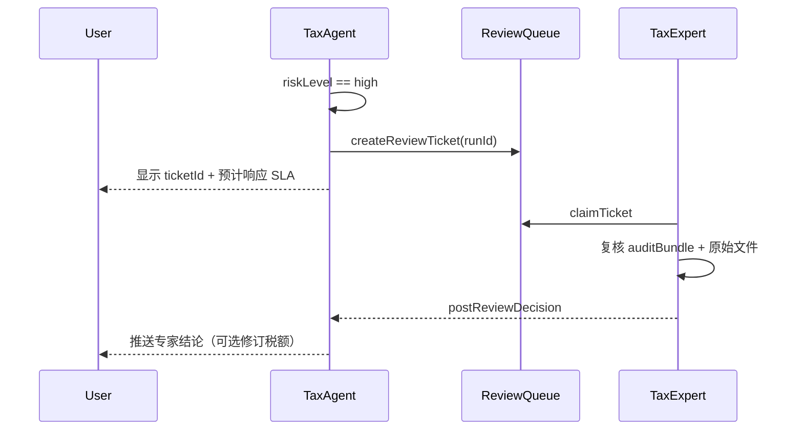

# 评估指标、风险分级与人工复核 v1

> **状态**：Frozen — v1.0  
> **修订日期**：2026-06-04

---

## 1. 上线门槛指标

| 指标 ID | 定义 | v1 门槛 | 测量方法 |
|---------|------|---------|----------|
| `parse_field_f1` | 关键字段 F1（日期、金额、币种、eventType） | ≥ 0.98 | 标准券商模板 golden set |
| `compute_delta_cny` | 与专家手工表差异（确定性场景） | ≤ 1 RMB | `golden_deterministic` 20 例 |
| `explain_trace_rate` | 结果行可追溯至 sourceEventIds | 100% | 自动化审计脚本 |
| `high_risk_recall` | 高风险案例召回率 | ≥ 0.95 | 标注 `expectedRisk=high` 集 |
| `compute_latency_p95` | 单账户 ≤10 万条计算 P95 | < 10s | 压测 |
| `upload_parse_p95` | 首次上传解析 P95（5MB xlsx） | < 30s | 压测 |

### 1.1 关键字段定义（解析）

`tradeDate`, `grossAmount`, `currency`, `eventType`, `symbol`（资本利得场景）

### 1.2 确定性场景定义

- `residentStatus = cn_tax_resident`
- 无 `ambiguous` 分类
- `parse_field_f1` 对应文件 = 1.0
- 汇率表完整无 fallback

---

## 2. 风险分级

### 2.1 等级定义

| 等级 | 标签 | 用户可见行为 |
|------|------|--------------|
| `low` | 低 | 输出单点 `netTaxDueCny` + 标准免责声明 |
| `medium` | 中 | 输出区间 `netTaxDueRangeCny` + 缺失项清单 |
| `high` | 高 | **不输出最终税额**；强制人工复核工单 + 教育性说明 |

### 2.2 触发规则（可叠加，取最高）

```yaml
riskRules:
  - id: R001
    condition: residentStatus == uncertain
    level: high
  - id: R002
    condition: residentStatus == non_resident
    level: high
    message: 非中国税务居民不在本规则包范围
  - id: R003
    condition: count(classificationStatus == ambiguous) > 0 AND ambiguousAmountCny > 1000
    level: medium
    message: 成本基础不完整；输出参考税额并提示补全年份税表（富途生产 v1 不阻断出数）
  - id: R004
    condition: dataQuality.coverage.withholding < 0.8
    level: medium
  - id: R005
    condition: brokerTemplateId == template_unknown
    level: medium
  - id: R006
    condition: confidenceScore < 0.85
    level: medium
  - id: R007
    condition: hasStockCompensation == true
    level: high
    message: 股权激励草稿税额已输出，须专家复核成本基础与申报口径
  - id: R008
    condition: filingScope == includes_domestic && !domesticIncomeProvided
    level: medium
    message: 已选含境内综合所得但未提供境内收入，结果仅含境外部分
  - id: R009
    condition: crsAccountCountMismatch == true
    level: high
  - id: R010
    condition: ruleSnapshot.status == deprecated
    level: medium
    message: 使用已弃用规则快照，建议用 latest_stable 重算
```

### 2.3 confidenceScore 计算（v1 启发式）

```text
confidenceScore = min(
  parse_field_f1_weighted,
  1.0 - 0.1 * count(ambiguous),
  dataQuality.coverage.withholding,
  1.0 if residentStatus == cn_tax_resident else 0.0
)
```

---

## 3. 人工复核流程



### 3.1 工单字段

| 字段 | 说明 |
|------|------|
| `ticketId` | UUID |
| `runId` | 关联计算 |
| `riskLevel` | 固定 `high` |
| `triggeredRules` | R001–R010 ID 列表 |
| `slaHours` | 48（工作日） |
| `status` | `open`, `claimed`, `resolved`, `escalated` |

### 3.2 专家结论类型

- `confirm_agent` — 维持 Agent 测算  
- `revise_amount` — 附修订后 `TaxLineItem`  
- `reject_compute` — 资料不足，要求用户补充  
- `refer_to_authority` — 建议咨询主管税务机关  

---

## 4. 测试集结构

```text
tests/fixtures/golden/
  deterministic/     # 20 例，期望 netTaxDue 精确
  missing_data/      # 10 例，期望 partial + medium
  ambiguous/         # 5 例，期望 high
  credit_edge/       # 8 例，抵免边界
```

每个用例文件：`case_001.json`

```json
{
  "caseId": "det_001",
  "input": { "datasetFixture": "ibkr_2024_small.json" },
  "parameters": {
    "taxYear": 2024,
    "residentStatus": "cn_tax_resident",
    "fxPolicy": "safe_harbor_monthly",
    "ruleSnapshotId": "cn_resident_us_equity@2026.06.01"
  },
  "expected": {
    "netTaxDueCny": "710.00",
    "riskLevel": "low"
  }
}
```

---

## 5. 监控与告警（生产）

| 告警 | 条件 | 动作 |
|------|------|------|
| `HIGH_RISK_SPIKE` | 1h 内 high 占比 > 30% | 检查解析模板/规则变更 |
| `COMPUTE_ERROR` | 错误率 > 1% | 考虑规则回退 |
| `PARSE_F1_DROP` | 7 日滑动 F1 < 0.95 | 暂停未知模板自动计算 |
| `REVIEW_SLA_BREACH` | 工单 > 48h 未 claim | 升级值班专家 |

---

## 6. 免责声明版本管理

- `disclaimerVersion` 与规则快照独立版本化  
- 报告 Footer 必须渲染 `disclaimers.yaml` 三块：非法律意见、CRS、规则快照  

---

## 7. 变更记录

| 版本 | 日期 | 说明 |
|------|------|------|
| v1.0 | 2026-06-04 | 初始指标与风控 |
