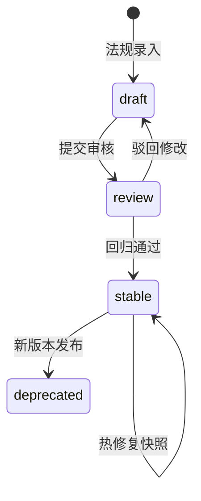
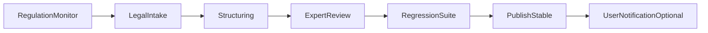

# 法规版本化仓库与发布流程 v1

> **状态**：Frozen — v1.0  
> **修订日期**：2026-06-04  
> **规则包目录**：[../rules/cn_resident_us_equity/](../rules/cn_resident_us_equity/)

---

## 1. 目标

实现「**最新规则自动更新**」同时保证：

- 每次计算可绑定不可变规则快照（可复现、可审计）
- 新法规发布后经审核与回归测试才进入 `stable`
- 异常时自动回退至上一 `stable` 版本

---

## 2. 规则仓库结构

```text
rules/
  cn_resident_us_equity/
    manifest.yaml          # 规则包元数据
    snapshots/
      2026.06.01/
        rules.yaml         # 税率、税目、公式
        fx_policy.yaml     # 汇率口径默认值
        credit_limit.yaml  # 抵免限额算法
        disclaimers.yaml   # 免责声明版本
    changelog.md
```

### 2.1 manifest.yaml 字段

| 字段 | 说明 |
|------|------|
| `rulePackId` | `cn_resident_us_equity` |
| `displayName` | 中国税务居民 · 美股收入 |
| `jurisdiction` | `CN` |
| `sourceJurisdiction` | `US` |
| `latestStable` | 当前稳定快照 ID |
| `supportedTaxYears` | 支持的纳税年度列表 |

### 2.2 快照 ID 命名

```text
{rulePackId}@{YYYY.MM.DD}
例：cn_resident_us_equity@2026.06.01
```

### 2.3 快照状态机



| 状态 | 可用于生产计算 | 说明 |
|------|----------------|------|
| `draft` | 否 | 开发/录入中 |
| `review` | 否（仅 staging） | 专家审核 + 自动化测试 |
| `stable` | 是 | `latest_stable` 指向此版本 |
| `deprecated` | 是（显式指定时） | 历史报告复算 |

---

## 3. 规则内容模型（rules.yaml）

```yaml
version: "2026.06.01"
taxYearDefault: 2025
categories:
  cn_interest_dividend:
    label_zh: "利息、股息、红利所得"
    rate: 0.20
    appliesTo: [DIVIDEND]
  cn_property_transfer:
    label_zh: "财产转让所得"
    rate: 0.20
    appliesTo: [CAPITAL_GAIN]
  cn_interest:
    label_zh: "利息所得"
    rate: 0.20
    appliesTo: [INTEREST]
credit:
  method: "per_item_limit"
  formula: "min(foreign_tax_paid_cny, tax_due_cny)"
  notes_zh: "境外已纳税额不超过该项应纳税额的部分可抵免"
```

**原则**：税率与税目映射以 YAML 声明；计算引擎只解释 DSL，不在代码中硬编码税率。

---

## 4. 自动更新（已实现基础版）

见 [rule-auto-update-v1.md](rule-auto-update-v1.md)：可信 Feed / inbox → 校验 → Golden 回归 → 可选自动 `publish_stable`。

---

## 5. 法规更新流水线（人工 + 自动）



### 4.1 阶段说明

| 阶段 | 执行者 | 产出 |
|------|--------|------|
| RegulationMonitor | 自动化 + 法务订阅 | 法规变更候选列表 |
| LegalIntake | 税务专家 | 变更说明、生效日期 |
| Structuring | 工程师 | 新快照目录 `snapshots/YYYY.MM.DD/` |
| ExpertReview | 持证税务师 | 签署审核记录 |
| RegressionSuite | CI | 通过率报告 |
| PublishStable | 发布系统 | 更新 `latestStable`，旧版 `deprecated` |

### 4.2 SLA 与告警

| 指标 | 阈值 |
|------|------|
| 已知重大法规变更未结构化 | 30 天内必须进入 `review` 或记录豁免 |
| `latest_stable` 快照年龄 | > 180 天触发复审提醒 |
| 回归测试失败仍发布 | **禁止** |

### 4.3 回退策略

1. 新 `stable` 发布后 72 小时内监控计算异常率。
2. 若 `computation_error_rate > 1%` 或专家标记严重错误 → 自动将 `latest_stable` 指回上一 `stable`。
3. 已生成报告保留原 `ruleSnapshotId`，UI 显示「规则已回退，建议重算」。

---

## 5. API：规则发布（内部）

### POST /rules/publish

**权限**：`role=tax_rule_admin`

**请求**：

```json
{
  "rulePackId": "cn_resident_us_equity",
  "snapshotId": "cn_resident_us_equity@2026.06.01",
  "targetStatus": "stable",
  "reviewerId": "expert-uuid",
  "regressionReportId": "reg-uuid"
}
```

**响应**：

```json
{
  "published": true,
  "previousStable": "cn_resident_us_equity@2026.03.01",
  "checksum": "sha256:..."
}
```

### GET /rules/snapshots?rulePackId=cn_resident_us_equity

返回可用快照列表及 `latest_stable`。

---

## 6. 计算时绑定

```python
# 伪代码 — 实现参考
def resolve_rule_snapshot(request):
    if request.rule_snapshot_id == "latest_stable":
        return repo.get_latest_stable(request.rule_pack_id)
    return repo.get_snapshot(request.rule_snapshot_id)
```

每次 `ComputationRun` 持久化：

- `ruleSnapshotId`
- `checksum`（来自 manifest）
- 完整 `parameterSnapshot`（含 fxPolicy、taxYear）

---

## 7. 回归测试要求

发布 `stable` 前必须通过：

| 套件 | 用例数（v1 最低） |
|------|------------------|
| `golden_deterministic` | 20（专家标注期望值） |
| `missing_data_partial` | 10 |
| `ambiguous_classification` | 5 |
| `credit_limit_edge` | 8 |

存储路径建议：`tax_agent/tests/fixtures/golden/`

---

## 8. 变更记录

| 版本 | 日期 | 说明 |
|------|------|------|
| v1.0 | 2026-06-04 | 初始流水线 + 样例规则包 |
