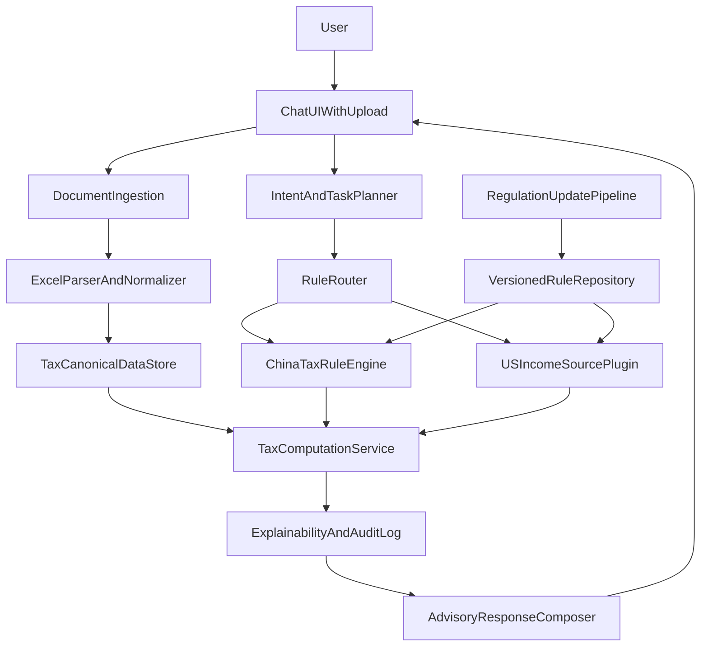
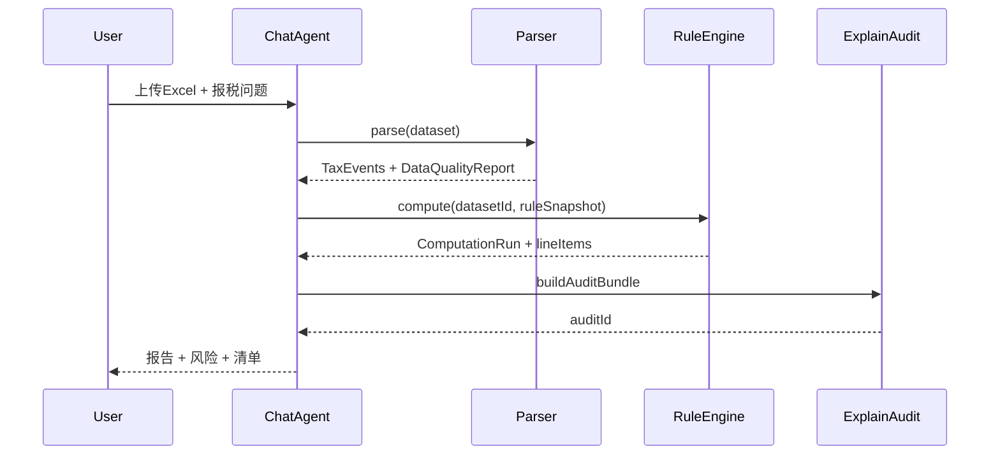

# Tax Agent 技术架构 v1

> **状态**：设计 + 规格落地（文档 / Schema / 规则样例）  
> **修订日期**：2026-06-04  
> **模型说明**：本文档由 **Composer** 编写。  
> **首场景**：[v1-scope-crs-us-equity.md](v1-scope-crs-us-equity.md)

---

## 0. 文档索引

| 专题 | 文档 |
|------|------|
| v1 边界 | [v1-scope-crs-us-equity.md](v1-scope-crs-us-equity.md) |
| 数据模型 | [canonical-data-model-v1.md](canonical-data-model-v1.md) |
| 规则版本化 | [rule-versioning-pipeline-v1.md](rule-versioning-pipeline-v1.md) |
| 测算规格 | [cn-us-equity-calculation-spec-v1.md](cn-us-equity-calculation-spec-v1.md) |
| 评估与风控 | [eval-risk-manual-review-v1.md](eval-risk-manual-review-v1.md) |

---

## 1. 目标

构建可在对话中接收 Excel/CSV 税务材料的报税 Agent，按用户指令完成税额测算与申报建议；v1 聚焦**中国大陆税务居民 · CRS 语境 · 美股收入**，法规采用**版本化自动更新**。

---

## 2. 非目标

- 不自动向税务机关申报  
- 不替代持证税务师法律意见  
- v1 不覆盖多国税法插件（仅 `cn_resident_us_equity` 规则包）

---

## 3. 系统架构



### 3.1 模块职责

| 模块 | 职责 |
|------|------|
| ChatUIWithUpload | 多文件上传、会话、免责声明展示 |
| DocumentIngestion | 病毒扫描、加密存储、哈希记录 |
| ExcelParserAndNormalizer | 券商模板匹配 → `TaxEvent` |
| IntentAndTaskPlanner | NL → `ComputeRequest` |
| RuleRouter | 按 `rulePackId` 加载快照 |
| ChinaTaxRuleEngine | 分类、计税、抵免 |
| USIncomeSourcePlugin | 美股行语义、FIFO 配对 |
| ExplainabilityAndAuditLog | `FormulaStep` + `AuditBundle` |
| AdvisoryResponseComposer | 摘要 / 明细 / 清单 / 风险 |
| RegulationUpdatePipeline | 见 [rule-versioning-pipeline-v1.md](rule-versioning-pipeline-v1.md) |

---

## 4. 时序



---

## 5. API 契约

| 方法 | 路径 | 说明 |
|------|------|------|
| POST | `/tax/upload` | 上传解析 → `datasetId` |
| POST | `/tax/compute` | 测算 → `runId` |
| GET | `/tax/report/{runId}` | 可读报告 + audit |
| GET | `/rules/snapshots` | 列出规则快照 |
| POST | `/rules/publish` | 内部发布 stable |
| POST | `/tax/review/tickets` | 创建人工复核（high 自动） |

请求/响应 JSON Schema 见 `schemas/`。

---

## 6. 券商模板映射（摘录）

| templateId | 分红列 | 交易列 | 预扣税列 |
|------------|--------|--------|----------|
| `broker_ibkr_v1` | `Description` contains Dividend | `Trades` | `Withholding Tax` |
| `broker_schwab_v1` | `Transaction` = Dividend | `Trade Details` | `Federal Tax Withheld` |
| `broker_fidelity_v1` | `Action` = Dividend | `Activity` | `Withholding` |

完整映射表随实现置于 `tax_agent/mappings/`（v2 编码阶段）。

---

## 7. 安全与隐私

- 静态 AES-256、传输 TLS  
- RBAC：`user`, `tax_expert`, `tax_rule_admin`  
- 默认留存 180 天；用户可删除  
- 日志禁止明文证件号/完整账号  

---

## 8. MVP 里程碑（8–10 周）

| 阶段 | 周 | 交付 |
|------|-----|------|
| M1 | 1–2 | Schema、上传解析、IBKR 模板 |
| M2 | 3–4 | 分红 + 资本利得基础计算 |
| M3 | 5–6 | 境外抵免 + 审计日志 |
| M4 | 7–8 | 规则发布流水线 + golden 测试 |
| M5 | 9–10 | 灰度 + 人工复核 + 验收 |

---

## 9. 仓库布局

```text
tax_agent/
  README.zh-CN.md
  docs/           # 本套规格
  schemas/        # JSON Schema
  db/             # SQL 草案
  rules/          # 版本化规则包
  mappings/       # （M1）券商列映射
  tests/fixtures/ # （M4）golden 用例
```

---

## 10. 变更记录

| 版本 | 日期 | 说明 |
|------|------|------|
| v1.0 | 2026-06-04 | 初始架构合流 |
