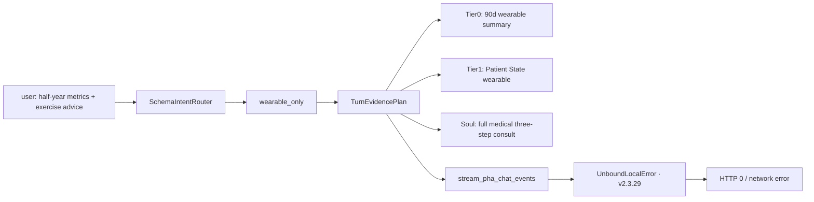

# Incident analysis: chat HTTP 0 + Hero panel empty (v2.3.29 @ :8788)

> **Language / 语言**：English (this document) · [中文](incident-analysis-chat-hero-2026-06-07.md)

> **Date**: 2026-06-07  
> **Build**: `pha-v2.3.29-wave4a-onboarding-ui-docker`  
> **Port**: 8788 (`.env`)  
> **Constraint**: analysis only; no code changes in this report.

---

## 1. Symptom summary

| Symptom | User-facing | Server evidence |
|------|------------|------------|
| Wearable / workout chat | `request failed HTTP 0` / `TypeError: network error` | `/tmp/pha-8788.log` shows `UnboundLocalError: user_message_needs_wearable_query` |
| Hero three cards | today steps / last-7d HRV / last-7d sleep all `—` | `GET /dashboard/hero-stats` returns all three fields `null`, `db_samples=14026` |

Repro sentence (user):

> Based on my body metrics over the past half year, give me some exercise suggestions

---

## 2. Issue A: chat failure (P0 · deterministic code defect)

### 2.1 Root cause

`pha/chat_service.py` → `stream_pha_chat_events()` has a **Python scope collision**:

- File top already `from pha.intent_gates import user_message_needs_wearable_query` (about L42)
- Function **latter half** imports the same name again (about L1868)
- Python treats the name as a **function-wide local**; the **first half** call (about L1634) runs before that local is assigned → **`UnboundLocalError`**

The SSE generator does not catch it → connection closes abruptly → browser `fetch` reports **HTTP 0 / network error** (not CORS or a port error).

### 2.2 Routing chain (why this sentence hits it)

```text
resolve_schema_intent(msg)
  → profile: wearable_only (“body metrics” “exercise” + personal “I”)
build_turn_evidence_plan
  → Tier0: WEARABLE_90D_SUMMARY + TASK
  → Tier1: PATIENT_STATE_WEARABLE
stream_pha_chat_events
  → wearable branch → crash at L1634 (v2.3.29)
```

Unrelated to the literal “past half year” window — Harness still injects about 90 days / available in-ledger span; the crash is in orchestration **before** the LLM call.

### 2.3 Relation to rollback / architecture

| Version | This bug |
|------|--------|
| **v2.3.29 (current)** | **present** |
| v2.3.31 (unmerged, discarded on rollback) | **fixed** (removed L1868 duplicate import) |
| v2.3.30 health_education | **unrelated** (does not change the wearable path) |

**Conclusion**: rolling back to v2.3.29 fixed daemon/port experiments but **deliberately dropped the 1-line v2.3.31 chat fix**, so wearable chat always crashes.

### 2.4 Suggested fix (no architecture change, min diff)

1. **Cherry-pick / by hand**: delete the duplicate import at L1868 inside `stream_pha_chat_events` (keep the module-level import)
2. Run `scripts/pha_restart_accept.sh` + curl the repro sentence `POST /api/chat` and verify SSE to `event: done`
3. **Do not** reintroduce `pha_daemon.sh` to fix this bug (process model is orthogonal to the chat bug)

---

## 3. Issue B: Hero three cards empty (P1 · data window vs calendar)

### 3.1 Root cause (not a frontend render bug)

API live (2026-06-07):

```json
{
  "today_steps": null,
  "avg_hrv_7d": null,
  "avg_sleep_7d": null,
  "db_samples": 14026,
  "db_max_timestamp": "2026-05-21T12:00:00"
}
```

Logic chain:

```text
effective_query_reference_date()  → OS today 2026-06-07
hero_stats query window           → [2026-06-01, 2026-06-07] (last 7 days)
wearable_daily table              → 0 rows in that window
latest wearable day in DB         → 2026-05-21 (17 days behind)
```

Frontend `app.js` → `loadHeroStats()` correctly shows `—` for `null`; **API 200, no JS error**.

### 3.2 Relation to charts below

- Hero cards: **fixed “calendar last 7 days”**; empty if no data
- `metric-trends` etc.: may use a **longer history window** and still have curves → user may see “charts have data, Hero doesn’t” — a **product-design** conflict, not a code conflict

### 3.3 Suggestions (ops, no code)

| Priority | Action | Notes |
|--------|------|------|
| **P1** | Re-import Apple Health `export.zip` | Make `wearable_daily` cover real today |
| **P2** | `.env` set `PHA_ENV_DEMO_ANCHOR=2026-05-21` | Align system “reference day” to last data day; Hero 7-day window back to 5/15–5/21 |
| **P3** | Confirm `user_id=default` | Hero matches the imported user |

### 3.4 Architecture direction (later versions; no code this incident)

- When Hero has no 7-day data: fallback to “last 7 days with data anchored at `db_max_timestamp`” and UI-label “data as of YYYY-MM-DD”
- Link with the `sync-status` card: “wearable data is N days stale”

---

## 4. Code conflict vs version architecture

### 4.1 Running state vs Git history

```text
running: v2.3.29 + local patches (.env PHA_PORT=8788, pha_restart_accept reads .env, PHA-Serve.command)
Git HEAD: 3c4a8ed (v2.3.29)
unmerged: 3c801de (v2.3.30 health_education), v2.3.31 chat fix, pha_daemon (already clean)
```

| Capability | v2.3.29 current | Discarded on rollback | Relation to user symptom |
|------|--------------|------------|----------------|
| Wearable chat | **crash** | v2.3.31 fix | **direct cause** |
| Education dual lane | none | v2.3.30 | unrelated |
| Process supervisor | foreground Terminal | pha_daemon | unrelated (page can open) |
| Port | 8788 | 8787 default | unrelated (health 200) |

### 4.2 Harness architecture (designed behavior of this dialog on v2.3.29)



**Design notes**:

- When “half year” does not enter `parse_user_date_range`, the actual evidence window is decided by `build_wearable_90d_summary_block` / in-ledger span (once measured ~163 days). That is a **different source and window** from Hero “last 7 days” — intentional layering, but UI does not explain it to the user.

### 4.3 Conflict ruling vs Wave 5 / health_education

- **health_education** (v2.3.30): only affects education fallback with no personal hook; **does not fix** this sentence (“I” → lifestyle/wearable)
- **Wave 5 TurnOrchestrator split**: long-term reduces `stream_pha_chat_events` complexity and similar import regressions; **not required for this incident**

---

## 5. Solution roadmap (suggested order)

### Stage 0 — immediately verifiable (no code)

1. Browser `http://127.0.0.1:8788/dashboard/hero-stats?user_id=default` — if three fields `null` and `db_max_timestamp` is before today → confirm **stale data**
2. Check `/tmp/pha-8788.log` around the dialog for `UnboundLocalError` → confirm **chat bug**

### Stage 1 — min fix (1 line, prefer over full v2.3.30)

- Delete `chat_service.py` L1868 duplicate import (same as v2.3.31)
- Restart PHA, retest the dialog

### Stage 2 — data (Hero has numbers)

- Import latest Apple Health, or temporary `PHA_ENV_DEMO_ANCHOR=2026-05-21`

### Stage 3 — optional capability restore

| Need | Suggestion |
|------|------|
| Education without the ledger | cherry-pick `3c801de` (health_education) |
| Service stay-up | keep foreground `PHA-Serve.command`; daemon in a separate PR with soak |
| Hero smart fallback | new product need, separate item |

---

## 6. Conclusion

1. **Chat failure**: v2.3.29 **known regression** — duplicate import inside `stream_pha_chat_events` → `UnboundLocalError`; no causal link to port 8788 or rollback itself; **v2.3.31 already verified the fix**.
2. **Hero empty**: **in-ledger wearable data stops at 2026-05-21**; query window is **2026-06-01~06-07**; not a frontend fault; 14026 historical rows are still there.
3. **Architecture**: the two issues are **orchestration-layer bug (before C layer)** vs **data freshness + fixed 7-day window (product/data layer)**; do not mix them into “rollback failed” or “8788 port problem”.
4. **Recommend**: **1-line chat fix** first → then **backfill data or DEMO_ANCHOR** → then cherry-pick v2.3.30 as needed; **do not** full-forward v2.3.30 before the chat fix.

---

## Appendix: key code locations

| Module | Path | Notes |
|------|------|------|
| Chat crash | `pha/chat_service.py` L42 vs L1634 vs L1868 | duplicate import |
| Hero API | `pha/dashboard_api.py` `hero_stats()` | 7-day `wearable_daily` |
| Reference date | `pha/health_data.py` `effective_query_reference_date()` | OS today |
| Frontend Hero | `pha/static/js/app.js` `loadHeroStats()` | null → `—` |
| Intent routing | `pha/schema_intent_router.py` | wearable_only fallback |
