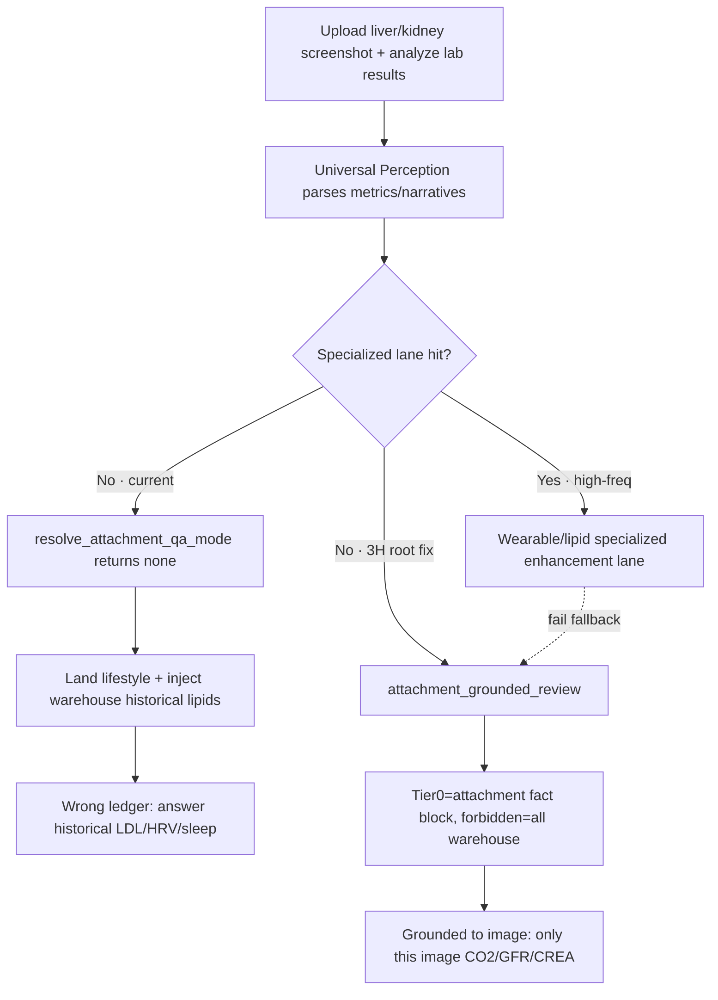

# RFC · Stage 3H — Universal Attachment Lane

> **Language / 语言**：English (this document) · [中文](rfc-stage3h-universal-attachment-lane.md)

> **Filename**: `docs/rfcs/rfc-stage3h-universal-attachment-lane.md`
> **Version**: v0.3 (2026-06-27)
> **Status**: ✅ **Closed (3H-α/β/γ/δ/ε fully coded · 148/148 stress accepted)**
> **Implementation log**: see [`../harness-change-log.md`](../harness-change-log.md) 2026-06-26～27; selfcheck `scripts/pha_universal_attachment_lane_selfcheck.py` (15/15); stress `scripts/pha_universal_attachment_stress_battery.py` (148/148 seed=20260626); error book [`anti-regression-constraints.md`](anti-regression-constraints.md)
> **Positioning**: fill the last mile of “any health screenshot → parse → display → talk about this image” with a **universal generalization fallback layer**, curing the vicious cycle of “hard-wire every class”. **Not** a patch for a single script.
> **Upstream (read-only)**: [`harness-consensus-opus48-2026-06-08.md`](../harness-consensus-opus48-2026-06-08.md) · [`pha-pm-constitution.md`](../pha-pm-constitution.md) (§1–4) · [`stage3f-intent-resolution-completeness-rfc.md`](../stage3f-intent-resolution-completeness-rfc.md) · [`pha-architecture-evolution-v2.3.md`](../pha-architecture-evolution-v2.3.md) (§8)
> **Downstream coding (design-locked; this RFC does not implement)**: `attachment_asset_qa` · `chat_turn_routing` · `harness_plan` · `harness_tier0_assembly` · `session_turn_focus` · `perception_family` · `health_intent_catalog.json`

---

## 0. Execution order and consensus bind

Any agent coding under this RFC must, before starting:

1. Read this document in full + [`harness-consensus-opus48-2026-06-08.md`](../harness-consensus-opus48-2026-06-08.md) §2 hard constraints;
2. Read [`pha-pm-constitution.md`](../pha-pm-constitution.md) Articles 1–4;
3. The first implementation reply contains: `CONSENSUS_ACK: rfc-stage3h-universal-attachment-lane read`.

**Forbidden**:

- Adding a `document_family` if-else or phrase allowlist inside Python routing to pass “one new screenshot type”;
- Letting LLM / Shadow directly choose `TurnEvidencePlan` or bypass C-layer numeric audit;
- Using “raise the Tier0 cap” or “pile more context” instead of completing the lane;
- Pulling warehouse history unrelated to this turn’s attachment inside the universal lane (warehouse physically isolated, see §5).

**Telemetry-driven statement (constitution Article 2)**: the first driver for this project is a real-device crash scene —

> The user uploaded a **liver/kidney function + electrolyte lab report** screenshot and asked “分析检验结果”; the system replied with **warehouse historical lipids (2023/2025 LDL/HDL/TC/TG) + HRV/sleep/supplement advice**, completely unrelated to the attachment (“wrong ledger, hallucinated answer”).

The root cause is not that a metric SQL could not be read, but a **routing-completeness gap**: structured facts dug by the generalized parse layer were discarded as garbage by a hardcoded last mile.

---

## 1. Problem statement (architectural completeness)

### 1.1 Upstream already universal, downstream forcibly classified

| Layer | Capability | Status |
|-------|------------|--------|
| **Perception parse** | OCR + Vision extract `results[]` (numbers) / `narratives[]` (text) | ✅ **Already family-agnostic universal** (`VISION_EXTRACTION_SYSTEM_PROMPT`) |
| **document_family classify** | supplement / lab / wearable / medication / **unknown** | ✅ Already has a fallback class |
| **Harness analysis lane** | profile selection + Tier0 inject | ❌ **Only supplement / wearable have specialized lanes** |
| **Parse-result display** | User-visible feedback | ❌ Only supplement / wearable complete |

### 1.2 Three collapse points in the last mile

```text
Any screenshot (non-wearable/non-supplement)
  → resolve_attachment_qa_mode: fam ∈ {lab, medication} → return "none" immediately   ← collapse A (kicked out of attachment QA)
  → build_turn_evidence_plan: fall profile=lifestyle (lightest lane)
  → Tier0 = TASK only, no ATTACHMENT_LABEL                                  ← collapse B (parse results never enter context)
  → focus_summary_from_parsed: only reads label_ledger/vision_summary/narratives,
     ignores metrics[]                                                          ← collapse C (lab numbers discarded)
  → lifestyle injects PATIENT_STATE_LAB (warehouse historical lipids)
  → LLM “fills blanks” on the three-step consult template → warehouse history substitutes this turn’s attachment
```

> Code locations of the three collapse points on current prod: see §5 (defensive-degrade landing points).

### 1.3 Why “enumerate by class” necessarily fails

The user input space is **infinite** (ECG, prescriptions, BP cuffs, CGM, nutrition labels, all kinds of App screenshots…). The system already has a generalization engine (LLM + Vision). **The right solution is long-tail via generalization fallback, specialized lanes only for a few high-frequency heads** — fully consistent with constitution Article 4 “perception base-layer generalization iron law” and consensus §3 “routing is brittle on long-tail expressions”.

---

## 2. State-of-the-art benchmarking

> Constitution Article 1: new-stage Specs must include SOTA comparison.

| Industry pattern | Mechanism | PHA local absorption | Parts we refuse to copy |
|------------------|-----------|----------------------|-------------------------|
| **OpenAI o-series native Tool Use routing** | Default general reasoning + tools only at high confidence | Universal fallback lane is default; specialized lanes are “high-confidence tools”-style optional enhancements | Do not hand the wheel to the LLM (health domain unverifiable, consensus §5) |
| **Anthropic Claude “grounding / cite your sources”** | Answers must anchor context evidence; no extrapolation | Universal-lane TASK hard-binds “answer only from this turn’s `results[]`/`narratives[]`” | Do not depend on unlimited cloud context stuffing |
| **Vercel AI SDK context trim / progressive enhancement** | Default slim + load on demand | Universal lane physically isolates warehouse; injects only this-turn attachment fact blocks | Do not raise lane weight for a single Fixture |
| **RAG “retrieval scope isolation”** | Retrieval domain strongly matches answer domain | Attachment-turn retrieval scope = this-turn parse facts; warehouse history forbidden | Do not mix cross-domain history into hallucination |

**Jurisprudence conclusion**: two-layer model (universal fallback default + specialized enhancement optional) = o-series “default general, tools at high confidence” + Claude grounding + progressive enhancement, fused locally and deterministically. **Not reinventing the wheel in a closet**.

---

## 3. Two-layer lane constitution (1 permanent beneficiary + N progressive enhancements)

```text
                    【 Any health screenshot upload 】
                             │
                             ▼
              [ Universal Perception parse layer (OCR+Vision) ]
               → results[] + narratives[] (family-agnostic)
                             │
                ┌────────────┴─────────────┐
        Hit specialized type? (declarative)  No (long-tail/unknown)
                ▼                            ▼
   【 Layer 2 · specialized enhancement 】  【 Layer 1 · universal fallback 】
   wearable_screenshot_review              attachment_grounded_review
   lab_cross_year (explicit cross-year)    · TASK anchor: grounded to this image
   · 90-day CompareTable                   · Physically isolate warehouse history
   · Cross-year trend warehouse link       · Display parse facts as-is
   · Invest only in high-freq high-value   · Build once, permanently cover ~90% long-tail
                │                            ▲
                └──────── fallback ──────────┘
              (specialized miss/fail → safe fall to universal layer,
                **never** fall to lifestyle warehouse)
```

**Core principles**:

| Principle | Statement |
|-----------|-----------|
| **Universal first** | Any `actionable` attachment + no specialized-lane hit → **must** land `attachment_grounded_review`, **strictly forbidden** to land `lifestyle` |
| **Specialized optional** | Specialized lanes are enhancements on the universal layer; on miss or fail **degrade to the universal layer**, not warehouse rambling |
| **Declarative class expansion** | New types only add `*.schema.json` + registry hints, **strictly forbidden** to change Python routing |
| **Warehouse isolation** | Universal lane `forbidden` explicitly bans all warehouse/history slots (§4.3) |

---

## 4. Universal-lane contract: `attachment_grounded_review`

### 4.1 Trigger (declarative, not phrase)

```text
Enter attachment_grounded_review iff:
  has_parse == True                                  # this turn has usable parse (attachment_parse_is_actionable)
  AND wearable_screenshot_review == False            # did not hit wearable specialized lane
  AND NOT user explicit cross-year lab intent (lab_cross_year)  # did not hit lipid cross-year specialized lane (existing predicate)
  AND qa_mode NOT IN (initial, lipid_bridge, episodic_bridge)  # did not hit supplement-asset specialized lane
```

> Predicate inputs are **structural signals only** (`has_parse` / `document_family` / existing specialized-lane booleans); introduce no business-word if-else such as “lab / liver function / ECG”. `document_family ∈ {lab, medication, unknown, other}` all equally slide into this lane.

### 4.2 Input contract (Tier0 slots)

| Slot | Content | Source |
|------|---------|--------|
| `MASTER_ANCHOR` | System time/identity anchor | existing |
| `ATTACHMENT_LABEL` | **This-turn attachment parse fact block** (see §4.4 upgrade) | `focus_summary_from_parsed` (after upgrade includes `metrics[]`) |
| `DATA_AVAILABILITY` | In-DB overview (read-only, **must not** be used as answer numeric source) | existing `build_data_availability_block` |
| `TASK` | Grounded-to-image defensive instruction (see §4.5) | new in this RFC |

`harness_tier0_assembly._PROFILE_CONFIG` new key:

```python
"attachment_grounded_review": {
    "priority": ["ATTACHMENT_LABEL", "DATA_AVAILABILITY", "TASK"],
    "protected": {"ATTACHMENT_LABEL", "TASK"},   # fact block and task never tail-truncated (consensus §2.2)
    "degradation_order": ["DATA_AVAILABILITY"],
    "supplement_start": "full",
}
```

### 4.3 Disable contract (warehouse physical isolation · forbidden)

```python
forbidden = [
    "GET_HEALTH_DATA", "GET_TEMPORAL_HISTORY_DOSSIER",
    "LDL_AUTHORITY", "PATIENT_STATE_LAB", "PATIENT_STATE_WEARABLE",
    "WEARABLE_90D_SUMMARY", "WEARABLE_COMPARE_TABLE",
    "DOSSIER_LAB", "DOSSIER_CLINICAL_COMPACT",
    "NUMERICS_MANIFEST",          # warehouse Manifest banned; this-turn facts from attachment only
    "USER_SNAPSHOT", "fetch_evidence_by_id",
]
tools_allowed = []   # universal fallback turn does not initiate warehouse tool calls
```

> This is a physical seal on the collapse points: even if the model wants warehouse historical lipids/HRV, the slots and tool allowlist no longer exist.

### 4.4 `metrics[]` fact-block upgrade (fix collapse C)

`session_turn_focus.focus_summary_from_parsed` behavior upgrade (design):

```text
Current: return label_ledger || vision_summary || json(narratives) || ""   # ignores metrics[]
Upgrade: when metrics[] non-empty and no label_ledger,
      serialize a deterministic fact table (immutable ledger, constitution Article 3):
      【附件解析事实 · 本轮唯一数字源】
      | 项目 | 结果 | 单位 | 参考区间 | 异常 |
      | CO2  | 27   | mmol/L | 22.0-29.0 | — |
      | GFR  | 92.26| mL/(min*1.73m2) | — | — |
      ... (truncation protection reuses _compress_attachment_label)
```

Points:

- The fact table is an **immutable ledger**; numbers 100% come from attachment parse; the model has no rewrite right (constitution Article 3);
- Reuse the existing `ATTACHMENT_LABEL` slot; do not create a parallel slot (minimal invasion);
- C-layer numeric audit continues: the attachment fact block is this turn’s Manifest equivalent; answer numbers must traceback to that block.

### 4.5 Defensive TASK Prompt spec (grounded to the image)

```text
【本轮任务 · 附件就图论事（Grounded）】
用户上传了一份健康相关截图，已解析为「附件解析事实」块（见 Tier0）。请用中文自然作答。

必须：
1) 先 1–2 句复述这是什么（依据解析事实/标题，勿臆断报告类型）。
2) 仅依据「附件解析事实」块中的 results/narratives 行作答：逐项给出数值、单位、参考区间，
   并指出明显偏离参考区间的项；每条数字须能对应事实块某一行。
3) 若用户问到事实块中不存在的指标：明说「本张截图未见该项」，禁止编造。

严禁：
- 引用或推断任何 **数仓历史数据**（历史血脂/HRV/睡眠/步数/补剂时间表）——本轮上下文已物理移除这些块。
- 使用「纵向趋势对账 / 多指标横向联动 / 硬核非药物干预」三步看诊模板标题。
- 把本张截图的指标归因到无关历史，或反向把历史数字套到本张图。
- 编造未在事实块中出现的数值、诊断或参考区间。

全文约 450 字以内。如需历史趋势对比，提示用户「先归档此报告后再问跨期趋势」。
```

> Consistent with `wearable_screenshot_review` / `attachment_asset_qa` SOUL closeout: no three-step template, no warehouse crosstalk, stick to the facts.

### 4.6 Output and display contract (fix collapse “visible feedback”)

| Stage | Behavior |
|-------|----------|
| SSE status | After parse, push `📎 已解析：N 项指标 / M 段叙述` |
| User-message preview | Reuse `【附件定账摘要 · 供核对】`; when `metrics[]` non-empty, switch to fact-table preview |
| `done.ingest_payload` | Reuse existing “save to health archive” button → `/api/chat/messages/{id}/ingest` (**zero new ingest channel**, reuse existing `ingest_chat_message`) |

> Ingest path (chat attachment → `ingest_chat_message` → `ingest_parsed_payload` → SQLite) is homologous with the data-import drawer. **This RFC does not change ingest**, only “display + analysis”.

---

## 5. Defensive-degrade landing points (design-locked)

> Instruction #2: explicitly change `resolve_attachment_qa_mode` and `focus_summary_from_parsed`; **strictly forbidden** to kick lab/unknown out or slide into lifestyle.

| Landing | Current | Upgrade (design) | Collapse |
|---------|---------|------------------|----------|
| `attachment_asset_qa.resolve_attachment_qa_mode` | `fam ∈ {wearable, lab, medication} → "none"` | No longer kick lab/medication out in one step; new return `"grounded"` (only when no specialized-lane hit and `has_parse`). `wearable` still `none` (goes wearable specialized lane) | A |
| `chat_turn_routing.resolve_turn_routing` | qa_mode=none + non-wearable → no lane | qa_mode=`grounded` → `attachment_grounded_review`; lab/unknown with `has_parse` and no specialized hit always safely route here | A/B |
| `harness_plan.build_turn_evidence_plan` | lab/unknown → lifestyle | New `attachment_grounded_review` plan branch (§4.2–4.3), priority above lifestyle fallback | B |
| `session_turn_focus.focus_summary_from_parsed` | Ignores `metrics[]` | `metrics[]` non-empty → serialize deterministic fact table (§4.4) | C |
| `harness_tier0_assembly._PROFILE_CONFIG` | No such profile | New `attachment_grounded_review` assembly config (§4.2) | B |
| `harness_profile_registry._KNOWN_ASSEMBLY_PROFILES` | None | Add `attachment_grounded_review` + slot invariants (`required_tier0={ATTACHMENT_LABEL, TASK}`) | — |

**Key invariant**: `lifestyle` remains “**no-attachment** pure-text fallback”; **once this turn has an actionable attachment, it must never land lifestyle**.

---

## 6. Declarative expansion standard (new-type onboarding SOP)

> Goal: future “ECG / prescription / BP cuff / CGM …” **zero Python routing change**.

| Desired effect | Onboarding | Files changed |
|----------------|------------|---------------|
| New type correctly parsed + universal fallback grounded to image | **Zero onboard** (universal lane default fallback) | none |
| New type recognized as its own `document_family` label | Add OCR scoring markers (declarative data) | `perception_media` score table (data, not business if-else routing) |
| New type gets a **specialized enhancement** lane | Add `storage/schemas/<type>.schema.json` (`display` + `trigger_keywords` + `catalog.profiles`) + registry `intent_hints` | `*.schema.json` / registry JSON |
| **Forbidden** | Write `if family == "xxx"` in `harness_plan` / `chat_turn_routing` | — |

**Admission bar (specialized lane)**: reuse v2.3 §8 open question 4 Registry admission — L2 warehouse ready + Manifest domain + intent block + ≥3 golden sentences each. **Anyone below the bar stays on the universal fallback layer**.

---

## 7. Constraint alignment (do-not-break check)

| Hard constraint (consensus §2 / constitution) | This RFC alignment |
|-----------------------------------------------|--------------------|
| TurnEvidencePlan before LLM | `attachment_grounded_review` is a deterministic plan; profile/slot/forbidden/tools first |
| Tier0 budget protection | `ATTACHMENT_LABEL` + `TASK` listed `protected`, not tail-truncated |
| C-layer numeric audit traceable | Attachment fact block is this turn’s unique numeric source; answer numbers must match fact rows |
| Harness Veto | `tools_allowed=[]` + forbidden bans fetch; LLM cannot overreach warehouse |
| Shadow zero-adopt | No adopt path; Shadow remains telemetry only |
| Do not hand the wheel to the LLM | Routing decided by L2 structural signals, not LLM self-chosen profile |
| No Python phrase routing | Trigger only `has_parse` + existing specialized-lane booleans; class expansion via schema/registry |
| Reflection only R0/R1 | This RFC adds no LLM free reflection; R0/R1 audit unchanged |
| Constitution Article 4 generalization iron law | Universal fallback is exactly “pave the road from the bottom”, family-agnostic |

---

## 8. Phases and Flag

| Phase | Content | Flag | Rollback |
|-------|---------|------|----------|
| **3H-α (P1 root fix)** | `attachment_grounded_review` universal lane: routing landings A/B + plan + Tier0 assembly + forbidden warehouse isolation + TASK | `PHA_UNIVERSAL_ATTACHMENT_LANE=1` | unset flag → revert original `resolve_attachment_qa_mode` behavior |
| **3H-β (P1 fact block)** | `focus_summary_from_parsed` serialize `metrics[]` fact table + display preview | same flag | same |
| **3H-γ (P2 enhancement optional)** | Existing wearable/supplement lanes explicitly declare “fail fall to universal layer”; declarative class-expansion SOP documented | reuse existing flag | config revert |

> **3H-γ implementation (2026-06-26)**: `attachment_grounded_fallback.py`, when a specialized lane (`wearable_screenshot_review` / `attachment_asset_qa` / `attachment_episodic_bridge`) lacks structured data but `metrics[]`/`narratives[]` still exist, safely rebinds to `attachment_grounded_review` at slot-assembly time (`harness_profile_registry._PROFILE_GROUNDED_FALLBACK` explicit declaration). **Never** fall to lifestyle.

### 6.1 Declarative class-expansion SOP (ops handbook)

| Goal | Action | Files changed | Forbidden |
|------|--------|---------------|-----------|
| New screenshot type “can parse + grounded to image” | **Zero onboard** (universal fallback default on) | none | — |
| New `document_family` label | Add OCR scoring markers (declarative data) | perception score table / schema hints | Python `if family ==` |
| High-freq type wants specialized enhancement (cross-year trend etc.) | Add `storage/schemas/<type>.schema.json` + registry `intent_hints` | `*.schema.json` / registry JSON | Change `harness_plan` / `chat_turn_routing` |
| Specialized lane ship | Registry admission: L2 warehouse + Manifest domain + golden ≥3 sentences | schema + registry + golden | Below-bar stays on universal fallback |

**Specialized-lane failure**: auto-fall to `attachment_grounded_review` (3H-γ), not lifestyle.

> Default `PHA_UNIVERSAL_ATTACHMENT_LANE` on during env-8788 verification; after gray pass, become default-on.

---

## 9. Acceptance and regression (consensus §6 mandatory)

| Check | Expectation |
|-------|-------------|
| Upload liver/kidney-function screenshot + “分析检验结果” | Land `attachment_grounded_review`; answer **only contains this image’s metrics** (CO2/GFR/CREA…), **not** warehouse historical lipids/HRV/sleep |
| harness report `profile` field | `attachment_grounded_review` (not `lifestyle`) |
| Universal-lane Tier0 | Has `ATTACHMENT_LABEL` (with metrics fact table) + `TASK`; **no** warehouse slots |
| `focus_summary_from_parsed(metrics-only payload)` selfcheck | Returns non-empty fact table |
| Existing wearable/supplement scripts regression | No degrade (still their specialized lanes) |
| `pha_harness_profile_registry_selfcheck` | `attachment_grounded_review` slot invariants pass |
| New selfcheck | `pha_universal_attachment_lane_selfcheck.py`: lab/medication/unknown three families all route universal lane + forbidden contains all warehouse slots |

**Rollback path**: `unset PHA_UNIVERSAL_ATTACHMENT_LANE` → `resolve_attachment_qa_mode` / `build_turn_evidence_plan` revert original (lab→none→lifestyle); `focus_summary_from_parsed` upgrade is **pure increment** (behavior unchanged when metrics empty), no rollback needed.

**Telemetry regression**: after ship, monitor share of `profile=attachment_grounded_review` + `numerics_audit` fail rate under that profile (should ≈ 0, because the numeric source is single).

---

## 10. Non-goals

- ❌ Do not implement code in this RFC (design-locked; coding is separate 3H-α/β/γ PRs).
- ❌ Do not change the ingest path (`ingest_chat_message` reuse, zero new).
- ❌ Do not build a closed loop just for “lab reports” — this RFC is the root fix for “never build a closed loop for any single type”.
- ❌ Do not add LLM free reflection / Shadow adopt.
- ❌ Do not touch the data-import drawer’s pageLedger (frontend display reuse is a 3H-γ option).

---

## Appendix A · Causal chain (crash → root fix)


